# School_District_Analysis
School District Analysis

## Table of Contents
- [Overview of Project](#OverviewProject)
  * [Background](#Background)
  * [Purpose](#purpose)
- [Results](#results)
    * [District Summary](#DistrictSummary)
    * [School Summary](#SchoolSummary)
    * [Top 5 performing schools based on overall passing rate](#Top5)
    * [Bottom 5 performing schools based on overall passing rate](#Bottom5)
    * [Math scores by grade](#mathScoresbyGrade)
    * [Reading scores by grade](#readingScoresbyGrade)
    * [Scores by school spending per student](#Schoolspending)
    * [Scores by school size](#SchoolSize)
    * [Scores by school type](#SchoolType)
- [School and District Analysis Summary](#Summary)
- [Resources](#resources)

## Overview of Project
### Background

Maria is a chief Data Scientist for **City School District** and is reponsible for analyzing information from a variety of resources. My job is to assist her to analyze data on student funding and students standardized test scores. We are given access to every students math and reading scores as well as various information on the school data tab. My task is to aggregate the data and showcase trends in school performance. This analysis will help the school board suprintendent in making decisions regarding the school's budget and priorities.

### Purpose

Every school information and every students test scores for maths and reading have been populated in the following files: [schools_complete.csv](Resources/students_complete.csv) and [students_complete.csv](Resources/students_complete.csv).  

I am tasked to provide the following information:

1. A high-level snapshot of the **district's key metrics**, presented in a table format.
2. An overview of the **key metrics for each school**, presented in a table format.
3. Tables presenting each of the following metrics:
   * **Top 5** and **bottom 5 performing schools**, based on the overall passing rate.
   * The **average math score** received by students in **each grade level at each school.**
   * The **average reading score** received by students in **each grade level at each school.**
4. School performance based on the **budget per student.**
5. School performance based on the **school size.** 
6. School performance based on the **type of school.**
 
 **For this purpose I am using Jupyter notebook to write my code and generate the required report.**

## Results

The school board has notified Maria and her supervisor that the students_complete.csv file shows evidence of academic dishonesty; specifically, reading and math grades for **Thomas High School ninth graders** appear to have been altered. For this purpose we will replace the math and reading scores for **Thomas High School** with **NaNs** while keeping the rest of the data intact. The results below show a comparison of both analysis - before and after replacement of the grades by Nan and describe how these changes affected the overall analysis.
 
### District Summary

 The district summary consists of the following fields:  

* **Total Schools**: in the district  
* **Total Students**: in all the schools in that district 
* **Total Budget**: allocated to all the schools in the district 
* **Average Math Score**: This is calculated by adding all the math scores of the students for all the schools and then dividing it by the total number of students in the district.   
* **Average Reading Score**: This is calculated by adding all the reading scores of the students for all the schools and then dividing it by the total number of students in the district. 
* **% Passing Math**: This is calculated by adding all the **math scores >= 70** from all the schools and then dividing it by the total number of students in the district. 
* **% Passing Reading**: This is calculated by adding all the **reading scores >= 70** from all the schools and then dividing it by the total number of students in the district. 
* **% Overall Passing**: This is calculated by adding all the **math and reading scores >= 70** from all the schools and then dividing it by the total number of students in the district. 
#### Before NaN:

 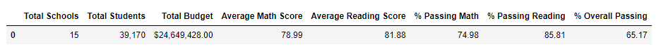 

#### After NaN:

 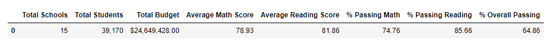 

 1. From the above District reports we see a slight change in the scores for math and reading.
 2. The Average Math Score has reduced from **78.99 to 78.93**
 3. The Average Reading Score has reduced from **81.88 to 81.86.**
 4. % Passing Math Score has reduced from **74.98% to 74.76%**
 5. % Passing Reading Score has reduced from **85.81% to 85.66%**.
 6. % Overall Passing has reduced from **65.17% to 64.86%**. 

### School Summary

Below are the School Summary Reports:

#### Before NaN:

[All Schools Summary Report before NaN](Images/schoolsummary.png)

Below is a snapshot of the school report for 'Thomson High School' for a comparison:

 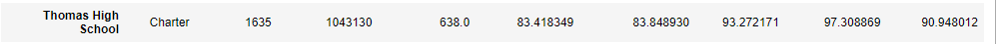 

#### After NaN:

[All Schools Summary Report after NaN](Images/schoolsummary_nan.png)

Below is a snapshot of the school report for 'Thomson High School' for a comparison:

 
 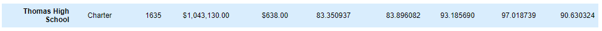 

1. The school summary report remains unchanged for all the schools except for **'Thomson High School'.**
2. The Average Math score has reduced from **83.41 to 83.35** 
3. The Average Reading score has reduced from **83.84 to 83.89**
4. % passing math reduced from **93.27% to 93.18%.**
5. % passing reading reduced from **97.3% to 97.01%.**
6. % Overall Passing also reduced from **90.94% to 90.63%.**

##  Top 5 performing schools based on overall passing rate
1. Thomas High School's ranking has not changed even when the data for the 9th grade is not included in our calculations.
2. It remains at #2 amongst all other schools in the district.
#### Before NaN:

 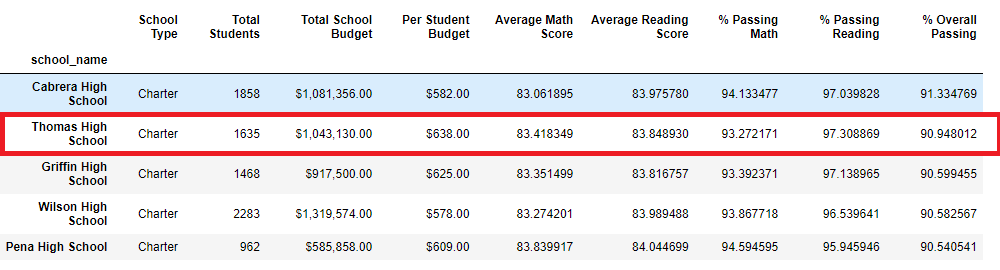 

#### After NaN:

 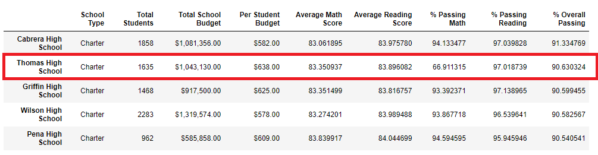 

##  Bottom 5 performing schools based on overall passing rate
Below is a list of bottom 5 performing schools. It remains unchanged.

#### Before NaN:

 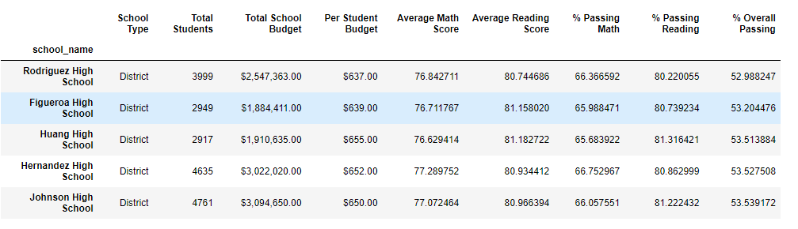 

#### After NaN:

 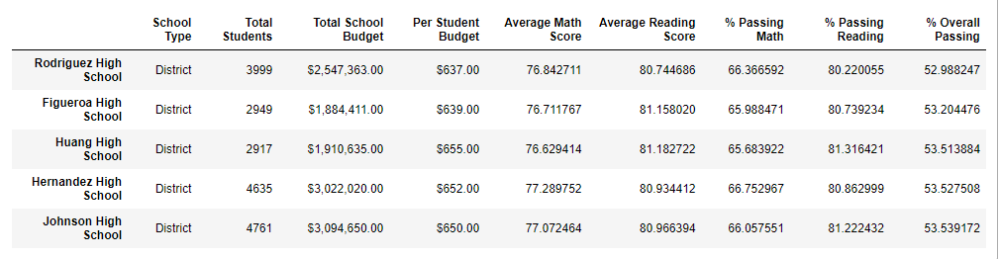 

## Math Scores by Grade

We have calculated the average math scores for every grade and every school.
Below are Math Score Reports for grade 9 to 12, for every school:

#### Before NaN:

[Math Scores by Grade before NaN](Images/mathscore.png)

Below is a snapshot of the math scores by grade for 'Thomson High School' for a comparison:

 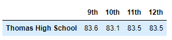 

#### After NaN:

[Math Scores by Grade after NaN](Images/mathscore_nan.png)

Below is a snapshot of the math scores for 'Thomson High School' for a comparison:

 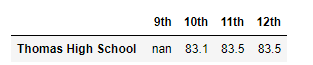 

1. The Average math score report remains unchanged for all the schools except for **'Thomson High School'.**
2. The Average Math score for 'Thomson High School' remains unchanged for grades 10th, 11th and 12th.
3. The Average Math score for 'Thomson High School' for 9th grade is represented as 'NaN' as we removed all the math and reading scores for 9th grade in the original dataframe.

## Reading Scores by Grade

We have calculated the average reading scores for every grade and every school.
Below are Reading Score Reports for grade 9 to 12, for every school:

#### Before NaN:

[Reading Scores by Grade before NaN](Images/readingscore.png)

Below is a snapshot of the reading scores by grade for 'Thomson High School' for a comparison:

 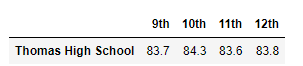 

#### After NaN:

[Reading Scores by Grade after NaN](Images/readingscore_nan.png)

Below is a snapshot of the reading scores for 'Thomson High School' for a comparison:

 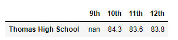 

1. The Average reading score report remains unchanged for all the schools except for **'Thomson High School'.**
2. The Average Reading score for 'Thomson High School' remains unchanged for grades 10th, 11th and 12th.
3. The Average Reading score for 'Thomson High School' for 9th grade is represented as 'NaN' as we removed all the math and reading scores for 9th grade in the original dataframe.

## Scores by school spending 

**Thomas High School** falls in the spending range of **<$630 - $644>** per student. As we see from the below 2 images, there is no change in the scores by school spending per student, when the math and reading scores for 9th grade in Thomas High School are not included in our calculations.

#### Before NaN:

 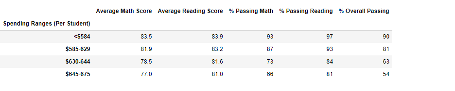 
 

#### After NaN:

 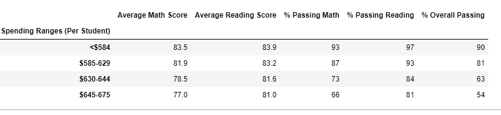 
 

## Scores by school size

**Thomas High School** is a medium sized school. As we see from the below 2 images, there is no change in the scores by school size by not including the math and reading scores for 9th grade in Thomas High School.

#### Before NaN:

 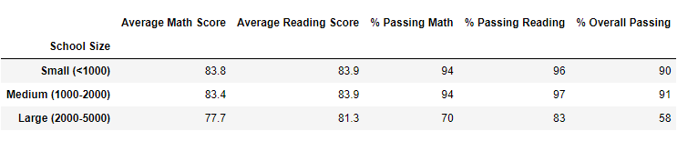 
 

#### After NaN:

 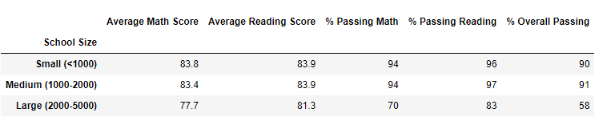 
 

## Scores by school type

**Thomas High School** is a Charter school.
As we see from the below 2 images, the scores by school type remain unchanged.

#### Before NaN:

 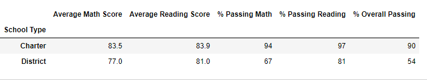 
 

#### After NaN:

 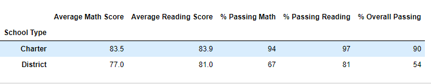 
 

## School and District Analysis Summary
Summarize four changes in the updated school district analysis after reading and math scores for the ninth grade at Thomas High School have been replaced with NaNs
From the above analysis done on all the schools in the district after reading and math scores for the ninth grade at Thomas High School have been replaced with NaNs, we conclude the following:
1. The math and reading scores dropped only slightly, almost neglible, at the District Level. Hence we can say, that the **district level summary** remained unchanged. 
2. The average math and reading scores for the **Thomas High School** dropped slightly before and after including Nans in the data for the 9th grade.
2. The %Passing Math, %passing Reading, %overall passing, also dropped slightly for Thomas High School only.  
4. The rankings of the schools remained unchanged. Thomas High School ranked 2nd both the times.
3. The Math and Reading scores for Thomas High school for 9th grade have been replaced by 'Nan' in the 'Scores by Grade' report. There was no change in the scores for any other grades for all the schools.

##  Resources
[1] [Code for School Analysis](PyCitySchool_Challenge.py)  
[2] [School Data](Resources/schools_complete.csv)  
[3] [Student Data](Resources/students_complete.csv)   

[4] Software: 
* Python 3.10.2
* Jupyter Notebook  

[5] Dependencies:
* Pandas Library
* Numpy Library
 
